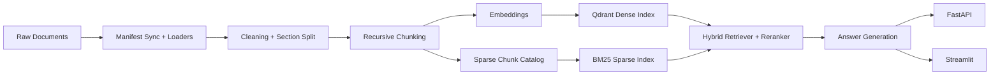

# University Knowledge Base RAG Assistant

A retrieval-augmented assistant that answers questions over university policies and handbook documents with grounded source citations.

## Project snapshot

- Domain: `University of Nebraska-Lincoln` undergraduate CS policies and student rules
- Corpus: `24` official documents, `285` parsed sections, `383` indexed chunks
- Retrieval stack: `OpenRouter embeddings + Qdrant dense index + BM25 sparse index + reranking`
- Product surfaces: `Streamlit UI + FastAPI API`

### Final metrics

| Evaluation | Metric | Score |
| --- | --- | ---: |
| Retrieval benchmark (59 questions) | Retrieval hit | `1.0000` |
| Retrieval benchmark (59 questions) | Top-1 hit | `0.9492` |
| Retrieval benchmark (59 questions) | Citation hit | `0.9831` |
| Answer-quality benchmark (18 questions) | Faithfulness mean | `0.9821` |
| Answer-quality benchmark (18 questions) | Completeness mean | `2.8571 / 3` |
| Answer-quality benchmark (18 questions) | Citation usefulness mean | `2.9444 / 3` |
| Answer-quality benchmark (18 questions) | Correct refusal rate | `1.0000` |

## Why this project

Generic chatbots often hallucinate or miss institution-specific rules. This project uses retrieval-augmented generation (RAG) to answer questions from curated university documents instead of relying on model memory alone.

It is designed to be a strong CV project because it demonstrates:

- document ingestion and parsing
- chunking and embeddings
- metadata-aware hybrid retrieval
- grounded answers with citations
- API and UI product surfaces
- retrieval evaluation and failure analysis on a real corpus
- answer-quality and refusal evaluation on a hosted-generation subset

## Current system

This repo currently implements a real-corpus RAG system with retrieval hardening:

- sync a public corpus from a manifest of official university URLs
- ingest PDF, HTML, Markdown, and text documents
- preserve `source`, `title`, `section`, `page`, `doc_type`, `year`, `url`, `program`, and `doc_id`
- chunk documents with a recursive splitter
- index dense vectors in Qdrant
- build a sparse BM25 index from chunk text
- fuse dense and sparse retrieval, rerank results, and diversify by source document
- answer questions with citations to retrieved chunks
- expose both a FastAPI API and a Streamlit UI
- compare dense vs hybrid retrieval against a handcrafted evaluation set
- evaluate hosted answers for faithfulness, completeness, citation usefulness, and refusal behavior

The current demo corpus is:

- University: `University of Nebraska-Lincoln`
- Scope: `Computer Science undergraduate program requirements + student academic policies`
- Source types: catalog pages, registrar pages, student accounts pages, financial aid pages, and official PDFs

## Sample queries

- `How many credits of CSCE 495 count as one tech elective course?`
- `When is priority registration for Fall Semester 2025?`
- `What late payment fee is assessed on delinquent student accounts?`
- `What is the deadline to appeal a parking ticket at UNL?`
  This should trigger a refusal because that policy is outside the indexed corpus.

## Architecture



## Screenshots

### Answer with citations


### Source panel


### Failure analysis artifact


## Tech stack

- Python
- FastAPI
- Streamlit
- LangChain text splitting and OpenAI-compatible integrations
- Qdrant
- rank-bm25
- pytest + ruff

## Local dev modes

This scaffold supports three modes:

1. Default local mode  
   Uses deterministic hash embeddings plus extractive answer synthesis so the app can run without paid APIs.
2. OpenAI mode  
   Uses OpenAI embeddings and generation.
3. OpenRouter mode  
   Uses OpenRouter's OpenAI-compatible API for embeddings and generation.

For a serious demo, use either OpenAI or OpenRouter mode. For smoke tests and offline development, local mode is enough, but retrieval quality will be lower than the hosted embedding-backed paths.

## Repo structure

```text
rag-assistant/
|- app/
|  |- fastapi_app.py
|  `- streamlit_app.py
|- data/
|  |- corpus_manifest.csv
|  |- raw/
|  |- parsed/
|  `- eval/
|- reports/
|  `- figures/
|- src/
|  |- answer_eval.py
|  |- answer.py
|  |- chunking.py
|  |- config.py
|  |- corpus.py
|  |- embed.py
|  |- evaluate.py
|  |- ingest.py
|  |- loaders.py
|  |- models.py
|  |- predict.py
|  |- retriever.py
|  `- sparse_index.py
|- tests/
|- Dockerfile
|- requirements.txt
`- README.md
```

## Getting started

### 1. Install dependencies

```powershell
python -m venv .venv
.venv\Scripts\Activate.ps1
pip install -r requirements.txt
```

Optional evaluation dependencies:

```powershell
pip install -r requirements-eval.txt
```

### 2. Configure the environment

```powershell
Copy-Item .env.example .env
```

For OpenAI:

```env
OPENAI_API_KEY=your_key_here
EMBEDDING_PROVIDER=openai
GENERATION_PROVIDER=openai
```

For OpenRouter:

```env
OPENROUTER_API_KEY=your_key_here
EMBEDDING_PROVIDER=openrouter
GENERATION_PROVIDER=openrouter
OPENROUTER_EMBEDDING_MODEL=openai/text-embedding-3-small
OPENROUTER_CHAT_MODEL=openai/gpt-4.1-mini
```

### 3. Sync and ingest the corpus

The repo uses `data/corpus_manifest.csv` as the source of truth for public document URLs and metadata. During ingestion, the app downloads those files into `data/raw/unl/` and indexes them.

```powershell
python -m src.ingest --recreate
```

### 4. Run the API

```powershell
uvicorn app.fastapi_app:app --reload
```

### 5. Run the UI

```powershell
streamlit run app/streamlit_app.py
```

## API endpoints

- `GET /health`
- `GET /metadata`
- `POST /ask`
- `POST /ingest`
- `POST /reindex`

## Retrieval evaluation

The repo includes a real evaluation set at `data/eval/unl_cs_policies_eval.csv`.

Run a single evaluation:

```powershell
python -m src.evaluate
```

Run the dense vs hybrid comparison:

```powershell
python -m src.evaluate --compare --generation-provider extractive
```

This writes:

- `reports/eval_results.json`
- `reports/retrieval_comparison.json`
- `reports/retrieval_failure_analysis.md`

The reports include:

- expected-document retrieval hit rate
- top-1 retrieval hit rate
- citation hit rate
- category breakdowns
- example failures for manual debugging
- dense vs hybrid fixes, remaining failures, and regressions

Current benchmark on the 59-question UNL eval set:

- Dense: retrieval `0.9831`, top-1 `0.7797`, citation `0.9322`
- Hybrid: retrieval `1.0000`, top-1 `0.9492`, citation `0.9831`

## Answer-quality evaluation

The repo also includes a curated hosted-generation subset at `data/eval/unl_cs_answer_eval_subset.csv`.

Run the answer-quality evaluation:

```powershell
python -m src.answer_eval --generation-provider openrouter --judge-provider openrouter
```

This writes:

- `reports/answer_eval_results.json`
- `reports/answer_failure_analysis.md`

The answer-quality run stores the generated answer, retrieved chunks, cited sources, refusal behavior, and config used for each question. It scores:

- Ragas faithfulness on supported questions
- a custom 0-3 completeness rubric against reference answers
- citation usefulness with deterministic checks against cited chunks
- refusal behavior on out-of-corpus questions

Current benchmark on the 18-question hosted-generation subset:

- Faithfulness mean: `0.9821`
- Completeness mean: `2.8571`
- Citation usefulness mean: `2.9444`
- Refusal behavior mean: `3.0`
- Supported pass rate: `0.8571`
- Correct refusal rate: `1.0`

The ingestion step also writes chunk inspection artifacts under `data/parsed/`, including:

- `chunk_preview.jsonl`
- `chunk_catalog.jsonl`
- `chunk_stats.json`
- `ingestion_manifest.json`

## Notes

- The current corpus uses public official UNL pages and documents captured through `data/corpus_manifest.csv`.
- OpenRouter can be used through its OpenAI-compatible endpoint and embeddings API: [Quickstart](https://openrouter.ai/docs/quickstart) and [Embeddings](https://openrouter.ai/docs/api-reference/embeddings).
- Qdrant local mode is convenient for development, but it does not support concurrent access from multiple Python processes. For shared API/UI access or parallel evaluation, set `QDRANT_URL` and use a normal Qdrant server.
